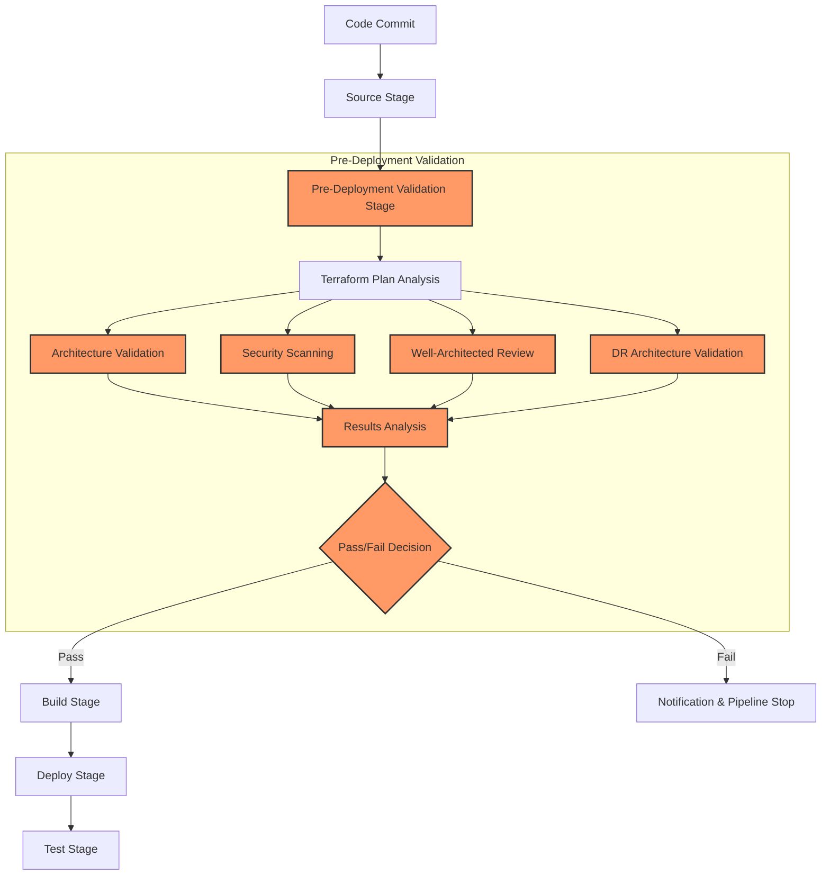

# Pre-Deployment Validation Flow

## Key Components

1. **Source Stage**: Code repository is checked out
2. **Pre-Deployment Validation Stage**:
   - **Terraform Plan Analysis**: Infrastructure plan is generated and analyzed
   - **Architecture Validation**: Validates against architectural best practices
   - **Security Scanning**: Checks for security vulnerabilities using Checkov
   - **Well-Architected Review**: Validates against AWS Well-Architected Framework
   - **DR Architecture Validation**: Validates DR-specific requirements
   - **Results Analysis**: Aggregates and analyzes results from all validation components
   - **Pass/Fail Decision**: Determines whether pipeline should continue
3. **Build Stage**: If validation passes, proceeds to build artifacts
4. **Deploy Stage**: Deploys validated infrastructure
5. **Test Stage**: Tests deployed infrastructure

## Validation Reports

The pre-deployment validation process generates comprehensive reports stored as artifacts:
- `architecture_validation.json`
- `security_scan.json`
- `well_architected.json`
- `dr_validation.json` (for DR environments)
- `validation_summary.json` (aggregated results)

These reports provide documentation for auditing, compliance, and architecture quality tracking.